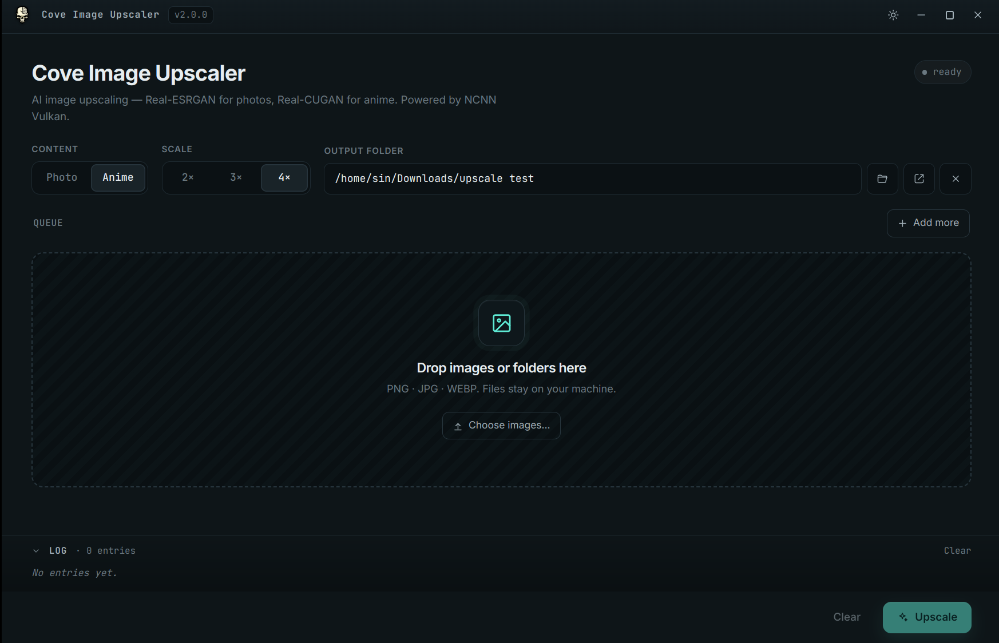
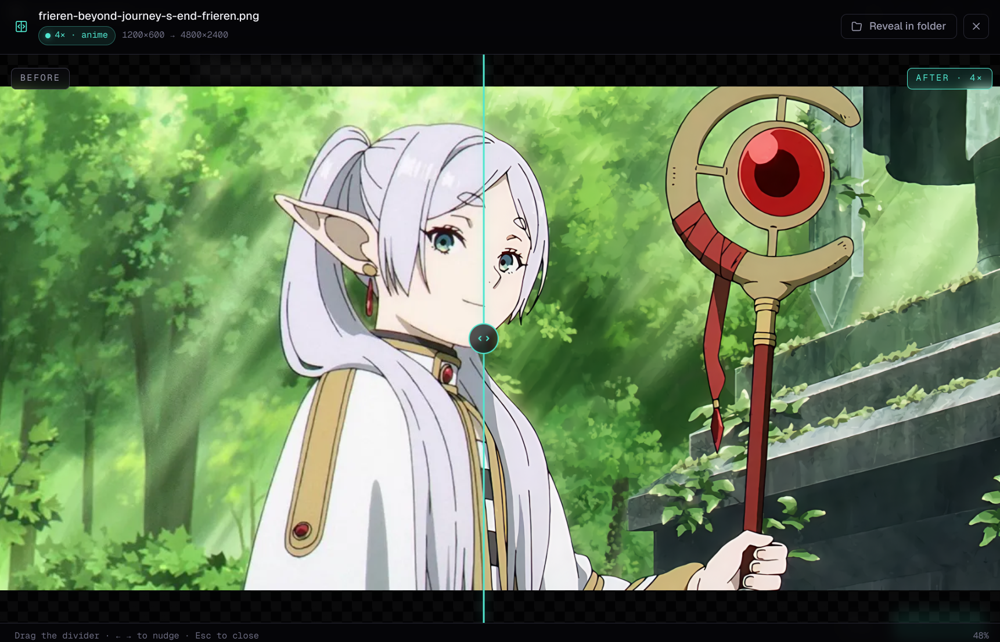

# Cove Image Upscaler

Cross-platform desktop app that upscales photos and anime images with AI,
powered by [NCNN](https://github.com/Tencent/ncnn) + Vulkan. No Python, no
CUDA, no cloud — runs fully offline on any Vulkan-capable GPU.

One codebase, four artifacts: a Windows installer + portable exe, and a
Linux AppImage + .deb. Every `v*` tag cuts all four via GitHub Actions.




---

## What it does

- **Photo upscaler** — Real-ESRGAN ×2 / ×3 / ×4. Photo non-4× runs the model
  at native ×4 and downscales locally to avoid the tile-stitch artifacts the
  binary produces with x4-only models at lower scales.
- **Anime upscaler** — Real-CUGAN ×2 / ×3 / ×4. Scale-aware denoise level
  (×2 uses the balanced denoise2x model; ×3 / ×4 use no-denoise to preserve
  line detail).
- **Queue + drag-drop** — drop files or whole folders any time, even after
  the queue is non-empty. Reorder pending entries by dragging. Click a row
  to select; press <kbd>Delete</kbd> to remove. Per-row cancel × on running
  jobs, refresh ↻ to re-run with current settings.
- **Compare modal** — full-screen before / after with a draggable divider,
  arrow-key nudge, dimension transition, reveal-in-folder.

  

- **Activity log** — collapsible panel below the queue. Color-coded events
  for every state transition. Friendly translations for common NCNN failures
  (out-of-memory, model mismatch, missing Vulkan, decode errors).
- **Vulkan GPU acceleration** — AMD, NVIDIA, Intel, Apple Silicon.
- **Light + dark** themes; remembers your choice. Window position persisted.
- **No cloud** — your images never leave the machine.

---

## Install a prebuilt release

Head to the [Releases page](https://github.com/Sin213/cove-image-upscaler/releases):

| OS      | Artifact                                            | Notes                                              |
| ------- | --------------------------------------------------- | -------------------------------------------------- |
| Windows | `Cove-Image-Upscaler-<version>-Setup.exe`           | NSIS installer (Start Menu + Desktop shortcut)     |
| Windows | `Cove-Image-Upscaler-<version>-Portable.exe`        | Single-file portable, no install                   |
| Linux   | `Cove-Image-Upscaler-<version>-x86_64.AppImage`     | `chmod +x` and run — needs `libfuse2`              |
| Linux   | `Cove-Image-Upscaler-<version>-amd64.deb`           | `sudo apt install ./Cove-Image-Upscaler-*.deb`     |

NCNN Vulkan binaries and models are fetched at build time and bundled — every
release ships self-contained.

### Linux AppImage troubleshooting

If the AppImage refuses to start with a FUSE error, install `fuse2`:

- Arch / EndeavourOS / Manjaro: `sudo pacman -S fuse2`
- Debian / Ubuntu / Mint: `sudo apt install libfuse2`
- Fedora: `sudo dnf install fuse`
- openSUSE: `sudo zypper install fuse`

### Windows SmartScreen

The installer and portable exe are unsigned, so Windows may warn on first
launch. Click **More info → Run anyway**.

---

## Running from source

Requires Node.js 20+, a Vulkan-capable GPU, and Git.

```bash
git clone https://github.com/Sin213/cove-image-upscaler.git
cd cove-image-upscaler
npm install           # also downloads NCNN Vulkan binaries for your host OS
npm run dev           # Vite + Electron with hot reload
```

`postinstall` fetches NCNN binaries + models for the host OS automatically.
On a flaky network it falls back silently; rerun with
`node scripts/download-binaries.mjs` (pass `linux`, `mac`, `win`, or `--all`
to override).

---

## Building release artifacts

```bash
# Linux
npm run dist:linux         # AppImage only — fast iteration
npm run dist:linux:full    # AppImage + .deb

# Windows (works cross-platform from Linux via Wine)
npm run dist:win           # Setup.exe + Portable.exe
npm run dist:win:portable  # Portable.exe only — fast iteration

# macOS (host must be macOS)
npm run dist:mac           # .dmg + .zip
```

When building Windows targets, run
`node scripts/download-binaries.mjs win` once to populate
`resources/bin/win/` with the right `.exe` + `.dll` files. Linux + macOS
builds need their respective binaries the same way.

### Automated release via GitHub Actions

Push a tag matching `v*` (e.g. `v2.0.0`) and `.github/workflows/release.yml`
runs the Linux + Windows jobs in parallel and attaches all four artifacts
to the GitHub Release created for the tag.

---

## Project layout

```
cove-image-upscaler/
├── electron/                     Electron main process (TypeScript)
│   ├── main.ts                   window + IPC + frameless titlebar
│   ├── paths.ts                  cross-platform binary/model paths
│   ├── preload.ts                contextBridge API
│   ├── upscaler.ts               job queue + ncnn child process + error humanizer
│   └── types.ts                  shared types (re-exported from src/)
├── src/                          React renderer (Vite + Tailwind)
│   ├── App.tsx                   layout + drop overlay
│   ├── store.ts                  zustand store + persistence
│   └── components/               Titlebar, Dropzone, ImageQueue, CompareModal, LogPanel, …
├── resources/
│   ├── bin/                      NCNN binaries — populated by postinstall
│   │   ├── linux/  mac/  win/
│   └── models/                   shared across platforms
├── public/cove_icon.png          renderer-served brand icon
├── scripts/download-binaries.mjs fetches NCNN binaries + models per host OS
├── cove_icon.png / cove_icon.ico window + installer icons
├── package.json                  electron-builder targets: linux + win + mac
└── .github/workflows/release.yml
```

---

## Licensing

- Cove Image Upscaler is **MIT** — see `LICENSE`.
- Bundled [Real-ESRGAN](https://github.com/xinntao/Real-ESRGAN) and
  [realcugan-ncnn-vulkan](https://github.com/nihui/realcugan-ncnn-vulkan)
  binaries are BSD-3-Clause / MIT. Models carry their upstream licenses.
